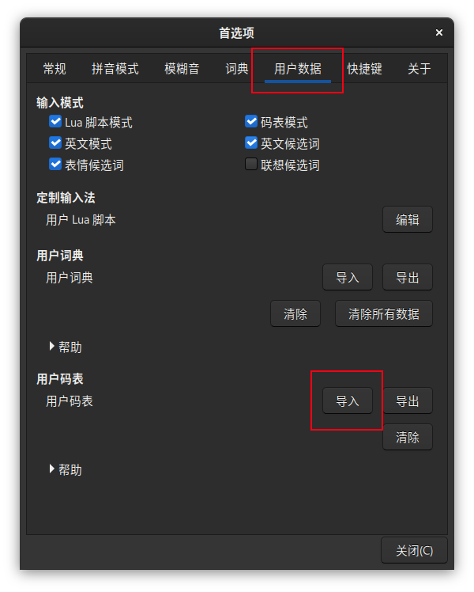
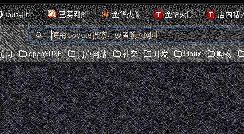

# ibus-libpinyin-zrm-table
适用于 ibus-libpinyin 的自然码辅码外挂码表，基于 https://github.com/mutoe/rime 
提供的形码方案，只保留了单字、双字和三字词组，词频采用 libpinyin 词库提供的数据。

## 使用方法
下载 zrm2000.table 文件，打开 ibus-libpinyin 的首选项，切换至“用户数据”标签，
在用户码表下面点击“导入”，选中 zrm2000.table 文件导入码表。

在输入过程中按下 Tab 键即可激活码表模式。

